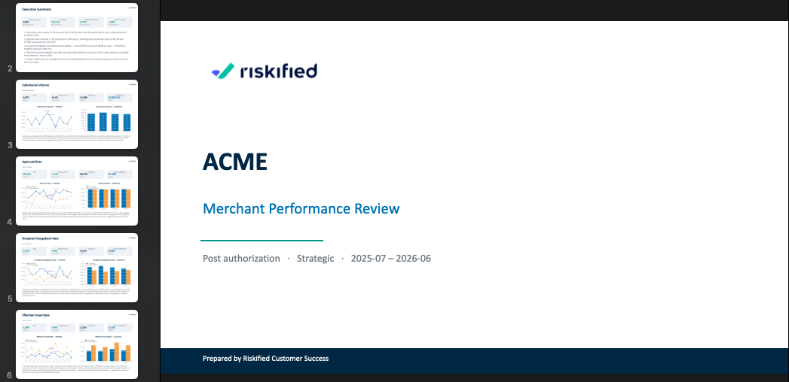
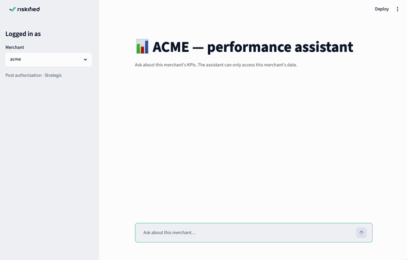

## 🎯 What is this?

Customer Success teams build merchant decks by hand — pulling KPIs, making charts, writing
commentary. This prototype **automates that**. Give it the merchant data and it:

1. 🦆 **Ingests & validates** the CSVs into a clean DuckDB dataset
2. 📑 **Generates a deck** per merchant (charts + AI narrative + executive summary)
3. 💬 **Serves a chat agent** that answers each merchant's questions about **their own** data

The golden rule throughout: **the AI writes the words, but never does the math.** Every number
is computed and tested in Python; the LLM only narrates. ✅

---

## 🚀 Quickstart — two ways to run

Pick whichever you already have. **Step 1 needs no key**; steps 2 & 3 need an Anthropic API
key 🔑. First, add it once:

```bash
git clone https://github.com/ldrory/riskified-hw.git && cd riskified-hw
cp .env.example .env          # then edit .env →  ANTHROPIC_API_KEY=sk-ant-...
```

**input files:**, put your 3 input CSV files into the `data/raw/` folder
(inside this project), using these exact names:

- `data/raw/merchant_profiles.csv`
- `data/raw/merchant_kpis.csv`
- `data/raw/merchant_evidence.csv`

Once that's done, the results will always appear in these two folders (inside this
project) after each run:

- `data/processed/riskified.duckdb` — the database
- `data/output/decks/<merchant>/` — the generated decks

You can open these normally, with your file browser or terminal — no Docker or Python
knowledge needed to find them.

> 💡 Prefer different filenames or a different folder for your CSVs? Pass all 3 paths in
> instead of renaming/moving anything (any subset can be overridden — the rest fall back
> to the default names above):
> - Local: `make ingest ARGS="--input-merchant-profiles=/path/profiles.csv --input-merchant-kpis=/path/kpis.csv --input-merchant-evidence=/path/evidence.csv"`
> - Docker: same 3 flags, but each path must be under `./data` on your machine (e.g.
>   `/app/data/raw/...`), since that's the only folder the container can see:
>   ```bash
>   docker compose run --rm ingest python scripts/ingest.py \
>     --input-merchant-profiles=/app/data/raw/custom_profiles.csv \
>     --input-merchant-kpis=/app/data/raw/custom_kpis.csv \
>     --input-merchant-evidence=/app/data/raw/custom_evidence.csv
>   ```

### 🐳 Option A — Docker (most reproducible, nothing to install but Docker)

```bash
docker compose run --rm ingest   # 1️⃣ build the DuckDB dataset   (no key needed)
docker compose run --rm decks    # 2️⃣ generate a deck per merchant
docker compose up app            # 3️⃣ chat agent  →  http://localhost:8501
docker compose run --rm tests    # (optional) run the full test suite
```

### 🐍 Option B — Local Python (no Docker; needs Python 3.11)

```bash
make setup     # create .venv + install pinned deps   (Windows: see below)
make ingest    # 1️⃣ build the DuckDB dataset          (no key needed)
make decks     # 2️⃣ generate a deck per merchant
make app       # 3️⃣ chat agent  →  http://localhost:8501
make test      # (optional) full test suite ·  make chat m=acme  for a terminal chat
```

<details><summary>🪟 No <code>make</code> / on Windows?</summary>

```bash
python -m venv .venv && .venv\Scripts\activate   # macOS/Linux: source .venv/bin/activate
pip install -r requirements.txt
python scripts/ingest.py
python scripts/generate_decks.py
python scripts/run_app.py
```
</details>

> 📌 Dependencies are **pinned** (`requirements.txt`) and Docker uses **Python 3.11** — so both
> paths run the exact versions this was built and tested with.

---

## 🧩 The three steps, visualized

### 1️⃣ Data ingestion → DuckDB 🦆

CSVs are loaded, **validated** (schema, ranges, duplicates, zero denominators, evidence
sanity), normalized, and persisted as **5 curated tables**. The database is the single source
of truth — both the decks and the agent read from it.


> 🔍 Peek inside any time: `duckdb -ui data/processed/riskified.duckdb`

### 2️⃣ Presentation decks 📑

Each deck: **Title → Executive Summary → one slide per KPI** (metric cards + monthly &
quarterly charts + a short CSM-style analysis) **→ Notes**. Consistent theme, branded, and
**customer-safe** (no internal jargon). Strategic merchants show both count and
amount-weighted views; Enterprise merchants show count only.

📂 **Three ready-made sample decks live in [`deliverables/`](deliverables/)** — open them, no
setup required. Regenerate fresh ones with `make decks`.



_The generated ACME deck open in PowerPoint — branded title slide + a slide per KPI._

### 3️⃣ Conversational agent 💬

A merchant-scoped Q&A agent over the same data. It explains KPI values, trends, calculations,
and evidence events — and **can only ever see one merchant's data** (isolation by
construction 🔒).

```text
🧑  acme ▸ How is my approval rate trending?
🤖  Approval Rate improved over the period — 96.84% (Jul 2025) → 98.15% (Jun 2026),
    +1.3%. The dip in Jan 2026 coincides with your "High Fraud" evidence event.

🧑  acme ▸ How is Cyberdyne Systems doing?
🤖  I can only help with ACME — I don't have access to other merchants' data.
```

🎥 **See it in action** (3× speed):



---

## 🏗️ Architecture (at a glance)


Deterministic data first, AI second. One curated fact layer feeds **both** the deck generator
and the agent, so they can never disagree. → Full detail in
**[docs/architecture.md](docs/architecture.md)**.

---

## 🛠️ Tech stack

| | |
|---|---|
| 🦆 **DuckDB** | embedded analytical store (table-first / ELT) |
| 🐼 **pandas** | data wrangling |
| ✅ **Pydantic** | typed contracts (metric defs, deck model, reports) |
| 📈 **matplotlib** | charts |
| 📑 **python-pptx** | PowerPoint generation |
| 🤖 **LangChain + Claude** | narrative + agent (provider-agnostic) |
| 🖥️ **Streamlit** | chat UI |
| 🧪 **pytest** | 162 tests, no network needed |

---

## 📚 Deeper docs (short & sharp)

| Doc | What's inside |
|---|---|
| 📐 [docs/architecture.md](docs/architecture.md) | How it's built · data flow · **validation & 4-layer quality model** · **security / tenant isolation** |
| 📝 [docs/writeup.md](docs/writeup.md) | The write-up: approach · assumptions · AI tooling · architecture choice · evaluation · **scale & safety** · trade-offs |
| 💬 [docs/prompts.md](docs/prompts.md) | Exact LLM prompts + the narrative guardrails |
| 📂 [deliverables/](deliverables/) | The generated sample decks |

---

## ✅ How this maps to the assignment

| Deliverable asked | Where |
|---|---|
| Source code | this repo |
| Setup & run instructions | ☝️ Quickstart |
| Generated presentation deck | [`deliverables/`](deliverables/) |
| Technical / product write-up | [docs/writeup.md](docs/writeup.md) |
| Prompts / LLM instructions | [docs/prompts.md](docs/prompts.md) |

| "What we want to see" | Where |
|---|---|
| Approach · assumptions · AI tools · architecture choice · quality evaluation · production scale & safety | [docs/writeup.md](docs/writeup.md) |
| Data ingestion · validation · charts · LLM analysis · presentation · architecture · scale (200–300 merchants) | [docs/architecture.md](docs/architecture.md) |

🔒 **Security:** the agent is bound to one merchant from the session; its tools close over that
`merchant_id` and never expose it — so it physically cannot read another merchant's data
(proven in tests). ✔️ **Validation:** a gate excludes bad merchants and aborts on global
errors, so one bad row never breaks a 200–300-merchant batch. Details in
[docs/architecture.md](docs/architecture.md).
