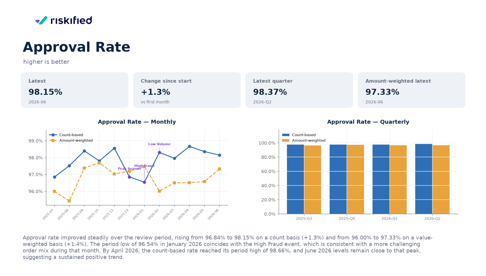
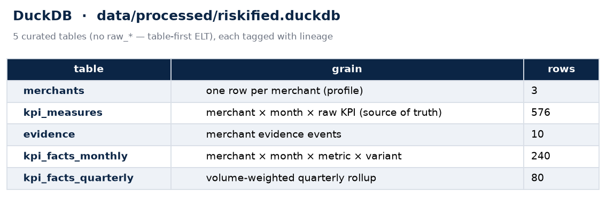
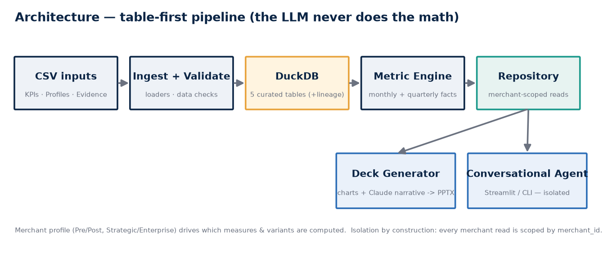

# 📊 Merchant Performance Review Automation

> Turn 3 merchant CSVs into **polished PowerPoint performance-review decks** 📑 and a
> **per-merchant conversational agent** 💬 — automatically.
>
> _Riskified Applied AI Engineer home assignment._



_A real generated slide: charts, metric cards, and an AI-written analysis._ 👆

---

## 🎯 What is this?

Customer Success teams build merchant decks by hand — pulling KPIs, making charts, writing
commentary. This prototype **automates that**. Give it the merchant data and it:

1. 🦆 **Ingests & validates** the CSVs into a clean DuckDB dataset
2. 📑 **Generates a deck** per merchant (charts + AI narrative + executive summary)
3. 💬 **Serves a chat agent** that answers each merchant's questions about **their own** data

The golden rule throughout: **the AI writes the words, but never does the math.** Every number
is computed and tested in Python; the LLM only narrates. ✅

---

## 🚀 Quickstart

**You need:** Python 3.11 🐍 and an Anthropic API key 🔑 (for steps 2 & 3 — step 1 needs none).

```bash
# 1. Get the code
git clone https://github.com/ldrory/riskified-hw.git && cd riskified-hw

# 2. Install
make setup                       # creates .venv + installs deps

# 3. Add your API key
cp .env.example .env             # then edit .env →  ANTHROPIC_API_KEY=sk-ant-...

# 4. Run the three steps
make ingest                      # 1️⃣ build the DuckDB dataset   (no key needed)
make decks                       # 2️⃣ generate a deck per merchant
make app                         # 3️⃣ open the chat agent  →  http://localhost:8501
```

That's it. 🎉 `make test` runs the full suite (no network needed). `make chat m=acme` gives a
terminal chat instead of the web UI.

<details><summary>🪟 No <code>make</code> / on Windows?</summary>

```bash
python -m venv .venv && .venv\Scripts\activate   # macOS/Linux: source .venv/bin/activate
pip install -r requirements.txt
python scripts/ingest.py
python scripts/generate_decks.py
python scripts/run_app.py
```
</details>

---

## 🧩 The three steps, visualized

### 1️⃣ Data ingestion → DuckDB 🦆

CSVs are loaded, **validated** (schema, ranges, duplicates, zero denominators, evidence
sanity), normalized, and persisted as **5 curated tables**. The database is the single source
of truth — both the decks and the agent read from it.



> 🔍 Peek inside any time: `duckdb -ui data/processed/riskified.duckdb`

### 2️⃣ Presentation decks 📑

Each deck: **Title → Executive Summary → one slide per KPI** (metric cards + monthly &
quarterly charts + a short CSM-style analysis) **→ Notes**. Consistent theme, branded, and
**customer-safe** (no internal jargon). Strategic merchants show both count and
amount-weighted views; Enterprise merchants show count only.

📂 **Three ready-made sample decks live in [`deliverables/`](deliverables/)** — open them, no
setup required. Regenerate fresh ones with `make decks`.

### 3️⃣ Conversational agent 💬

A merchant-scoped Q&A agent over the same data. It explains KPI values, trends, calculations,
and evidence events — and **can only ever see one merchant's data** (isolation by
construction 🔒).

```text
🧑  acme ▸ How is my approval rate trending?
🤖  Approval Rate improved over the period — 96.84% (Jul 2025) → 98.15% (Jun 2026),
    +1.3%. The dip in Jan 2026 coincides with your "High Fraud" evidence event.

🧑  acme ▸ How is Cyberdyne Systems doing?
🤖  I can only help with ACME — I don't have access to other merchants' data.
```

> 🎥 **Demo video:** _add your screen recording here_ → `docs/images/agent-demo.gif`

---

## 🏗️ Architecture (at a glance)



Deterministic data first, AI second. One curated fact layer feeds **both** the deck generator
and the agent, so they can never disagree. → Full detail in
**[docs/architecture.md](docs/architecture.md)**.

---

## 🛠️ Tech stack

| | |
|---|---|
| 🦆 **DuckDB** | embedded analytical store (table-first / ELT) |
| 🐼 **pandas** | data wrangling |
| ✅ **Pydantic** | typed contracts (metric defs, deck model, reports) |
| 📈 **matplotlib** | charts |
| 📑 **python-pptx** | PowerPoint generation |
| 🤖 **LangChain + Claude** | narrative + agent (provider-agnostic) |
| 🖥️ **Streamlit** | chat UI |
| 🧪 **pytest** | 162 tests, no network needed |

---

## 📚 Deeper docs (short & sharp)

| Doc | What's inside |
|---|---|
| 📐 [docs/architecture.md](docs/architecture.md) | How it's built · data flow · **validation & 4-layer quality model** · **security / tenant isolation** |
| 📝 [docs/writeup.md](docs/writeup.md) | The write-up: approach · assumptions · AI tooling · architecture choice · evaluation · **scale & safety** · trade-offs |
| 💬 [docs/prompts.md](docs/prompts.md) | Exact LLM prompts + the narrative guardrails |
| 📂 [deliverables/](deliverables/) | The generated sample decks |

---

## ✅ How this maps to the assignment

| Deliverable asked | Where |
|---|---|
| Source code | this repo |
| Setup & run instructions | ☝️ Quickstart |
| Generated presentation deck | [`deliverables/`](deliverables/) |
| Technical / product write-up | [docs/writeup.md](docs/writeup.md) |
| Prompts / LLM instructions | [docs/prompts.md](docs/prompts.md) |

| "What we want to see" | Where |
|---|---|
| Approach · assumptions · AI tools · architecture choice · quality evaluation · production scale & safety | [docs/writeup.md](docs/writeup.md) |
| Data ingestion · validation · charts · LLM analysis · presentation · architecture · scale (200–300 merchants) | [docs/architecture.md](docs/architecture.md) |

🔒 **Security:** the agent is bound to one merchant from the session; its tools close over that
`merchant_id` and never expose it — so it physically cannot read another merchant's data
(proven in tests). ✔️ **Validation:** a gate excludes bad merchants and aborts on global
errors, so one bad row never breaks a 200–300-merchant batch. Details in
[docs/architecture.md](docs/architecture.md).
